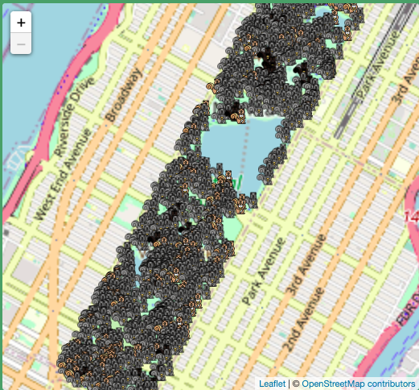
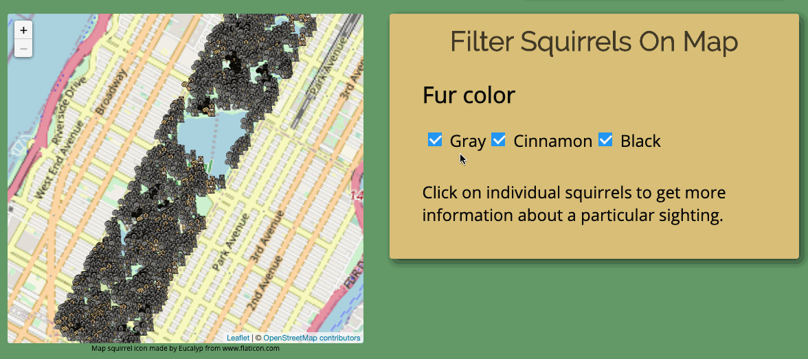
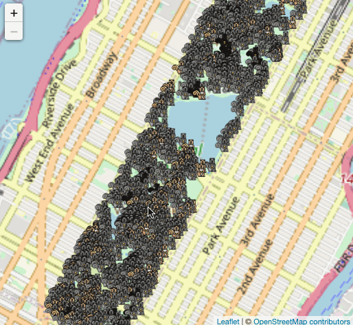
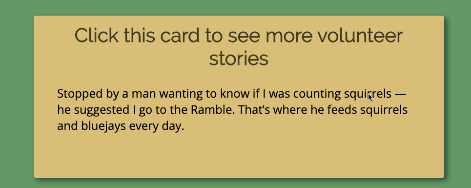

# Squirrels of Central Park

## Summary
In October 2018, 323 volunteer Squirrel Sighters representing [Squirrel Census](https://www.thesquirrelcensus.com/) counted the Eastern gray squirrels in Central Park. This project aims to visualize the data in a playful way that embodies the spirit of the project.

## Key Features
Users are able to
+ see the prevalance of different colored squirrels mapped over Central Park
> 
+ filter squirrels on map based on their fur color
> 
+ see fun details about other environmental details recorded during the sighting on click
> 
+ see stories shared by Squirrel Sighters during their volunteer work
> 

## Technology and Implementation Notes
+ Core technologies used: HTM5, CSS3, JavaScript, Leaflet.js
+ JSON sourced from [API for anonymized sightings data](https://data.cityofnewyork.us/resource/ej9h-v6g2.json) with focus on environmental details
+ GEOJSON sourced from [API for volunteer sightings data](https://data.cityofnewyork.us/resource/vfnx-vebw.geojson) with focus on color and coordinates

## Code Snippets / Learnings
### Filtering sqirrels
When the page is open, there are two categories of objects that need to render: a Leaflet.js base tile layer and the squirrel markers layers.

In order to determine which squirrels to render and where to render them, a custom XHR call does the following:
1. gets a [FeatureCollection](https://tools.ietf.org/html/rfc7946#section-3.3) GEOJSON object that contains an array of `Feature` objects representing each of the squirrel sightings and parses into JSON
2. groups squirrels into smaller GEOJSON objects representing their fur color: `blackSquirrels`, `cinnamonSquirrels`, `graySquirrels` in the format below which can be used as paramaters for Leaflet.js layers
```
const blackSquirrels = L.geoJSON(data, {
  filter: function(feature, layer) {
      return feature.properties.primary_fur_color === "Black";
  },
  pointToLayer: function (feature, latlng) {
    return L.marker(latlng, {
      icon: blackSquirrelIcon
    });
  },
  onEachFeature: defaultPopup
});
```
3. initially adds all of the squirrel layers to the map and uses event listeners to dynamically adds/removes them when their related checkboxes are clicked
```
filterFurBlack.addEventListener('change', function () {
      if (this.checked) {
        squirrelMap.addLayer(blackSquirrels);
      } else {
        squirrelMap.removeLayer(blackSquirrels);
      }
    });
```